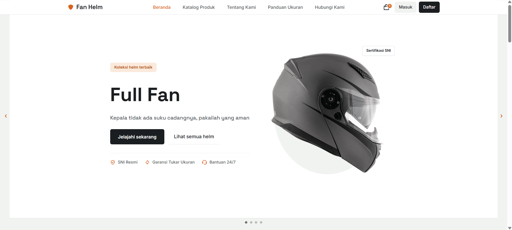
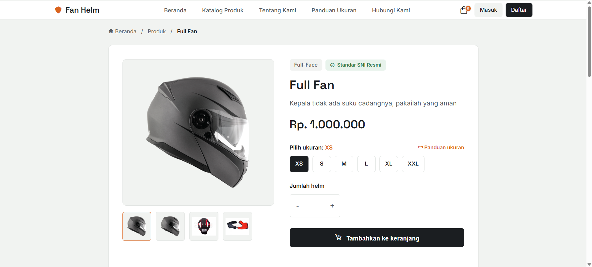
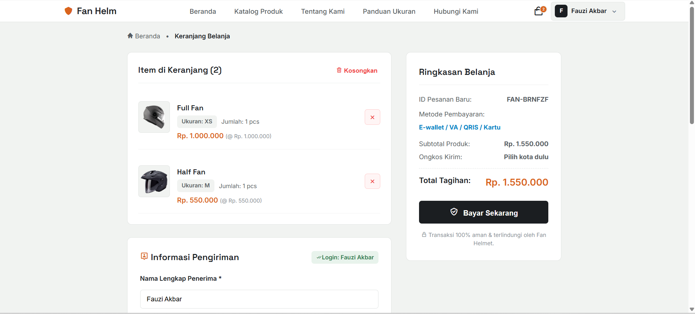
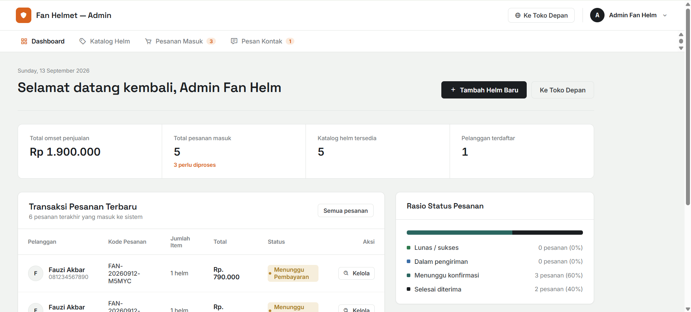

# Fan Helm — Website E-Commerce Helm Motor

Fan Helm adalah aplikasi web e-commerce untuk penjualan helm motor, dibangun menggunakan Laravel. Mencakup alur belanja lengkap mulai dari melihat produk sampai pembayaran, ditambah panel admin untuk mengelola toko.

## Fitur

**Toko (Storefront)**
- Katalog produk dengan varian ukuran dan harga
- Keranjang belanja dengan perhitungan ongkos kirim otomatis
- Alur checkout dengan invoice pesanan
- Pelacakan status pesanan berdasarkan kode pesanan
- Formulir kontak untuk pertanyaan pelanggan

**Pembayaran**
- Terintegrasi dengan payment gateway [Midtrans](https://midtrans.com) (Snap)
- Mendukung berbagai metode pembayaran: e-wallet (GoPay, ShopeePay, QRIS), transfer bank/virtual account (BCA, BNI, BRI, Permata, dan lainnya), kartu kredit, gerai minimarket (Indomaret/Alfamart), dan paylater (Akulaku, Kredivo)
- Status pembayaran diperbarui otomatis lewat webhook notifikasi Midtrans

**Panel Admin**
- Dashboard berisi ringkasan penjualan, status pesanan, dan aktivitas terbaru
- Manajemen katalog helm: tambah, edit, hapus produk
- Manajemen pesanan: lihat detail, ubah status, pantau pembayaran
- Kotak masuk pesan pelanggan dengan balas cepat lewat WhatsApp

## Teknologi yang Digunakan

- **Backend:** Laravel 11/12, PHP 8.2
- **Database:** MySQL
- **Payment Gateway:** Midtrans (Snap API)
- **Frontend:** Blade template, custom CSS

## Cara Menjalankan

### Kebutuhan
- PHP >= 8.2
- Composer
- MySQL
- Akun Midtrans (versi sandbox sudah cukup untuk uji coba)

### Instalasi

```bash
# Clone repository ini
git clone https://github.com/username-kamu/fan-helm.git
cd fan-helm

# Install dependency
composer install

# Salin file environment dan generate key
cp .env.example .env
php artisan key:generate
```

Atur database dan kredensial Midtrans di file `.env`:

```env
DB_DATABASE=fan_helm
DB_USERNAME=root
DB_PASSWORD=

MIDTRANS_SERVER_KEY=server-key-kamu
MIDTRANS_CLIENT_KEY=client-key-kamu
MIDTRANS_IS_PRODUCTION=false
```

Lalu jalankan migrasi database dan server:

```bash
php artisan migrate
php artisan serve
```

Buka `http://127.0.0.1:8000` untuk melihat halaman toko, atau `/admin` untuk masuk ke panel admin.

## Tangkapan Layar







## Catatan

Proyek ini dibuat secara mandiri sebagai latihan pengembangan aplikasi web full-stack menggunakan Laravel, termasuk integrasi payment gateway pihak ketiga dan perancangan panel admin.

## Lisensi

Proyek ini bersifat open-source untuk tujuan pembelajaran.
